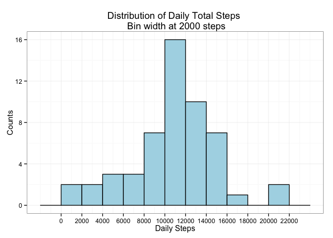

# Reproducible Research: Peer Assessment 1


```r
library(dplyr)
library(ggplot2)
```

## Loading and preprocessing the data

### Load from zip and preprocess


```r
activity <- read.csv(unz("activity.zip", "activity.csv"), colClasses = list(date = "Date"))

# Convert the intervals column into a factor, 
# so that during plotting/processing we won't treat them as integer numbers.
# (ie. we make the distance between 1155 and 1200 equal to the distance between 1145 and 1150)
# Also make the interval labels a bit more human-readable.
activity$interval <- factor(sprintf("%04d", activity$interval))
```

### Get a feeling about the general structure


```r
str(activity)
```

```
## 'data.frame':	17568 obs. of  3 variables:
##  $ steps   : int  NA NA NA NA NA NA NA NA NA NA ...
##  $ date    : Date, format: "2012-10-01" "2012-10-01" ...
##  $ interval: Factor w/ 288 levels "0000","0005",..: 1 2 3 4 5 6 7 8 9 10 ...
```


```r
summary(activity)
```

```
##      steps             date               interval    
##  Min.   :  0.00   Min.   :2012-10-01   0000   :   61  
##  1st Qu.:  0.00   1st Qu.:2012-10-16   0005   :   61  
##  Median :  0.00   Median :2012-10-31   0010   :   61  
##  Mean   : 37.38   Mean   :2012-10-31   0015   :   61  
##  3rd Qu.: 12.00   3rd Qu.:2012-11-15   0020   :   61  
##  Max.   :806.00   Max.   :2012-11-30   0025   :   61  
##  NA's   :2304                          (Other):17202
```

## What is mean total number of steps taken per day?

### Overview of the full distribution


```r
activity.by.day <- summarize(group_by(activity, date), total_steps = sum(steps, na.rm = TRUE))

p <- ggplot(activity.by.day, aes(x = total_steps))
p <- p + geom_histogram(binwidth = 2000, color = "black", fill = "lightblue")
p <- p + scale_x_continuous(breaks = seq(0, 22000, 2000))
p <- p + scale_y_continuous(breaks = seq(0, 16, 4))
p <- p + ggtitle("Distribution of Daily Total Steps \n Bin width at 2000 steps")
p <- p + xlab("Daily Steps") + ylab("Counts")
p <- p + theme_bw()
p
```

 

### The mean and the median of the distribution


```r
mean(activity.by.day$total_steps)
```

```
## [1] 9354.23
```

```r
median(activity.by.day$total_steps)
```

```
## [1] 10395
```

## What is the average daily activity pattern?


```r
activity.by.interval <- summarize(group_by(activity, interval), avg_steps = mean(steps, na.rm = TRUE))

p <- ggplot(activity.by.interval, aes(x = interval, y = avg_steps))
p <- p + geom_point() + geom_line(aes(group = 1))
p <- p + scale_x_discrete(breaks = c("0200", "0400", "0600", "0800", 1000, 1200, 1400, 1600, 1800, 2000, 2200))
p <- p + ggtitle("Average Daily Steps By Interval")
p <- p + xlab("Interval \n(format HHMM)") + ylab("Average Steps across All Days \n (NA's removed)")
p <- p + theme_bw()
p
```

 

The most active intervals:


```r
head(arrange(activity.by.interval, desc(avg_steps)))
```

```
## Source: local data frame [6 x 2]
## 
##   interval avg_steps
## 1     0835  206.1698
## 2     0840  195.9245
## 3     0850  183.3962
## 4     0845  179.5660
## 5     0830  177.3019
## 6     0820  171.1509
```

Interval `08:35` has the most step-activity on average across all days.

## Imputing missing values

### Missing values prevalence

In the summary above (in the section "Get a feeling about the general structure") we saw that only the `steps` column has missing values, the others are properly filled out.  
The proportion of missing vs. non-missing data is:


```r
table(is.na(activity$steps))
```

```
## 
## FALSE  TRUE 
## 15264  2304
```

```r
prop.table(table(is.na(activity$steps)))
```

```
## 
##     FALSE      TRUE 
## 0.8688525 0.1311475
```

13% is missing in the whole dataset.

### Imputation strategy

For each missing day/interval combination we should provide a value. Straighforward approaches would be:

* If an interval `x` is missing on a given day `y`, use the average of (non-missing intervals') steps on day `y` to fill.
* If an interval `x` is missing on a given day `y`, use the average of steps at interval `x` over the other days (where interval `x` is not missing).
* For averages we could use either the mean or the median.

To see why we can't use the the first approach, consider the following plot:


```r
p <- ggplot(activity, aes(y = date, x = interval, fill = steps))
p <- p + geom_tile() 
p <- p + scale_x_discrete(breaks = c("0200", "0400", "0600", "0800", 1000, 1200, 1400, 1600, 1800, 2000, 2200))
p <- p + scale_fill_continuous(na.value = "orange")
p <- p + ggtitle("Steps by Day and Interval")
p <- p + xlab("Interval \n(format HHMM)") + ylab("Date")
p <- p + theme_bw()
p
```

 

This plot is a heatmap of the day vs. interval matrix with orange cells marking missing values. Since the missing values are conditional on the day, we should use the interval averages for imputation.

For the average we will use the mean instead of the median. This is partly arbirtrary and partly suggested by the mean being the best point estimate from a sample to a popluation of measurements.

(Aboue the plot: note that reversing the Date axis would make more sense for a chronological order, but leaving it like this just leaves us with a bit of annoyance; it doesn't influence the purpose of the analysis.)

### Create filled dataset


```r
# Add a new temporary column (avg_steps) to the activity dataframe.
# It augments each row in the original dataset with the interval-average for the row's interval.
activity.filled <- merge(activity, 
                         summarize(group_by(activity, interval),
                                   avg_steps = mean(steps, na.rm = TRUE)))

# Use avg_steps to fill in missig values in steps column
activity.filled$steps <- ifelse(is.na(activity.filled$steps),
                                activity.filled$avg_steps,
                                activity.filled$steps)

# Remove the temporary column
activity.filled$avg_steps <- NULL
summary(activity.filled)
```

```
##     interval         steps             date           
##  0000   :   61   Min.   :  0.00   Min.   :2012-10-01  
##  0005   :   61   1st Qu.:  0.00   1st Qu.:2012-10-16  
##  0010   :   61   Median :  0.00   Median :2012-10-31  
##  0015   :   61   Mean   : 37.38   Mean   :2012-10-31  
##  0020   :   61   3rd Qu.: 27.00   3rd Qu.:2012-11-15  
##  0025   :   61   Max.   :806.00   Max.   :2012-11-30  
##  (Other):17202
```

### Compare filled dataset with original one

#### Statistics about the filled dataset


```r
activity.by.day.filled <- summarize(group_by(activity.filled, date), total_steps = sum(steps, na.rm = TRUE))

p <- ggplot(activity.by.day.filled, aes(x = total_steps))
p <- p + geom_histogram(binwidth = 2000, color = "black", fill = "lightblue")
p <- p + scale_x_continuous(breaks = seq(0, 22000, 2000))
p <- p + scale_y_continuous(breaks = seq(0, 16, 4))
p <- p + ggtitle("Distribution of Daily Total Steps after imputation\n Bin width at 2000 steps")
p <- p + xlab("Daily Steps") + ylab("Counts")
p <- p + theme_bw()
p
```

 


```r
mean(activity.by.day$total_steps)
```

```
## [1] 9354.23
```

```r
median(activity.by.day$total_steps)
```

```
## [1] 10395
```

```r
mean(activity.by.day.filled$total_steps)
```

```
## [1] 10766.19
```

```r
median(activity.by.day.filled$total_steps)
```

```
## [1] 10766.19
```

#### Visualization of the difference


```r
p <- ggplot(rbind(cbind(dataset = "original", activity.by.day),
                  cbind(dataset = "filed", activity.by.day.filled)),
            aes(x = total_steps))
p <- p + geom_histogram(binwidth = 2000) + facet_grid(dataset ~ .)
p
```

 


```r
p <- ggplot(rbind(cbind(dataset = "original", activity.by.day),
                  cbind(dataset = "filed", activity.by.day.filled)),
            aes(x = total_steps, color = dataset))
p <- p + geom_density(binwidth = 2000)
p
```

 

#### Description of the difference

Conclude what the difference is.

....

## Are there differences in activity patterns between weekdays and weekends?

```
mfrm$weekday <- ifelse(weekdays(mfrm$date) %in% c("Saturday", "Sunday"), "Weekend", "Weekday")
sfrm.intervals <- summarize(group_by(mfrm, interval, weekday), avg_steps = mean(steps, na.rm = TRUE))
ggplot(sfrm.intervals, aes(x = interval, y = avg_steps)) + geom_point() + scale_x_discrete(breaks = c("0600", 1200, 1800)) + facet_grid(weekday ~ .) + geom_line(aes(group = 1))
```

```
ggplot(sfrm.intervals, aes(x = interval, y = avg_steps, color = weekday)) + geom_point() + scale_x_discrete(breaks = c("0600", 1200, 1800)) + geom_line(aes(group = weekday))
```
