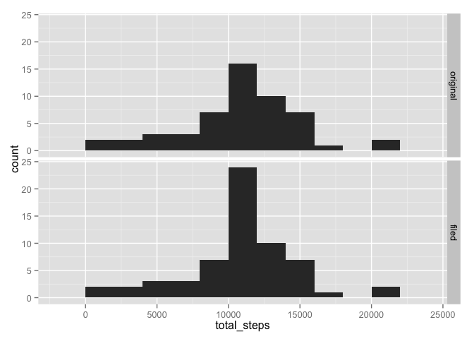

# Reproducible Research: Peer Assessment 1


```r
library(dplyr)
```

```
## 
## Attaching package: 'dplyr'
## 
## The following object is masked from 'package:stats':
## 
##     filter
## 
## The following objects are masked from 'package:base':
## 
##     intersect, setdiff, setequal, union
```

```r
library(ggplot2)
```

## Loading and preprocessing the data


```r
dfrm <- read.csv(unz("activity.zip", "activity.csv"), colClasses = list(date = "Date"))
dfrm$interval <- sprintf("%04d", dfrm$interval)
str(dfrm)
```

```
## 'data.frame':	17568 obs. of  3 variables:
##  $ steps   : int  NA NA NA NA NA NA NA NA NA NA ...
##  $ date    : Date, format: "2012-10-01" "2012-10-01" ...
##  $ interval: chr  "0000" "0005" "0010" "0015" ...
```


## What is mean total number of steps taken per day?


```r
sfrm.days <- summarize(group_by(dfrm, date), total_steps = sum(steps), avg_steps = mean(steps))
ggplot(sfrm.days, aes(x = total_steps)) + geom_histogram(binwidth = 1000, color = "black", fill = "lightblue")
```

 

```r
mean(sfrm.days$total_steps, na.rm = TRUE)
```

```
## [1] 10766.19
```

```r
median(sfrm.days$total_steps, na.rm = TRUE)
```

```
## [1] 10765
```


## What is the average daily activity pattern?


```r
sfrm.intervals <- summarize(group_by(dfrm, interval), avg_steps = mean(steps, na.rm = TRUE))
ggplot(sfrm.intervals, aes(x = interval, y = avg_steps)) + geom_point() + scale_x_discrete(breaks = c("0600", 1200, 1800))
```

 


```r
arrange(sfrm.intervals, desc(avg_steps))
```

```
## Source: local data frame [288 x 2]
## 
##    interval avg_steps
## 1      0835  206.1698
## 2      0840  195.9245
## 3      0850  183.3962
## 4      0845  179.5660
## 5      0830  177.3019
## 6      0820  171.1509
## 7      0855  167.0189
## 8      0815  157.5283
## 9      0825  155.3962
## 10     0900  143.4528
## ..      ...       ...
```


## Imputing missing values

### Missing values prevalence


```r
sum(!complete.cases(dfrm))
```

```
## [1] 2304
```

```r
mean(!complete.cases(dfrm))
```

```
## [1] 0.1311475
```

### Impute values from the days-average frame

Not too great, because there are days that are totally missing


```r
sfrm.days[!complete.cases(sfrm.days), ]
```

```
## Source: local data frame [8 x 3]
## 
##         date total_steps avg_steps
## 1 2012-10-01          NA        NA
## 2 2012-10-08          NA        NA
## 3 2012-11-01          NA        NA
## 4 2012-11-04          NA        NA
## 5 2012-11-09          NA        NA
## 6 2012-11-10          NA        NA
## 7 2012-11-14          NA        NA
## 8 2012-11-30          NA        NA
```

Nevertheless...


```r
mfrm <- merge(dfrm, sfrm.days)
mfrm$steps <- ifelse(is.na(mfrm$steps), mfrm$avg_steps, mfrm$steps)
mfrm$avg_steps <- NULL
mfrm$total_steps <- NULL
```


```r
msfrm.days <- summarize(group_by(mfrm, date), total_steps = sum(steps))
ggplot(msfrm.days, aes(x = total_steps)) + geom_histogram(binwidth = 1000, color = "black", fill = "lightblue")
```

 

```r
mean(msfrm.days$total_steps, na.rm = TRUE)
```

```
## [1] 10766.19
```

```r
median(msfrm.days$total_steps, na.rm = TRUE)
```

```
## [1] 10765
```


```r
ggplot() + geom_density(aes(total_steps, color = "original"), sfrm.days) + geom_density(aes(total_steps, color = "filled"), msfrm.days) 
```

```
## Warning: Removed 8 rows containing non-finite values (stat_density).
```

```
## Warning: Removed 8 rows containing non-finite values (stat_density).
```

 

### Impute values from the interval-average frame


```r
mfrm <- merge(dfrm, sfrm.intervals)
mfrm$steps <- ifelse(is.na(mfrm$steps), mfrm$avg_steps, mfrm$steps)
mfrm$avg_steps <- NULL
```


```r
msfrm.days <- summarize(group_by(mfrm, date), total_steps = sum(steps))
ggplot(msfrm.days, aes(x = total_steps)) + geom_histogram(binwidth = 1000, color = "black", fill = "lightblue")
```

 

```r
mean(msfrm.days$total_steps, na.rm = TRUE)
```

```
## [1] 10766.19
```

```r
median(msfrm.days$total_steps, na.rm = TRUE)
```

```
## [1] 10766.19
```


```r
ggplot() + geom_density(aes(total_steps, color = "original"), sfrm.days) + geom_density(aes(total_steps, color = "filled"), msfrm.days)
```

```
## Warning: Removed 8 rows containing non-finite values (stat_density).
```

 


## Are there differences in activity patterns between weekdays and weekends?


```r
mfrm$weekday <- ifelse(weekdays(mfrm$date) %in% c("Saturday", "Sunday"), "Weekend", "Weekday")
sfrm.intervals <- summarize(group_by(mfrm, interval, weekday), avg_steps = mean(steps, na.rm = TRUE))
ggplot(sfrm.intervals, aes(x = interval, y = avg_steps)) + geom_point() + scale_x_discrete(breaks = c("0600", 1200, 1800)) + facet_grid(weekday ~ .) + geom_line(aes(group = 1))
```

 


```r
ggplot(sfrm.intervals, aes(x = interval, y = avg_steps, color = weekday)) + geom_point() + scale_x_discrete(breaks = c("0600", 1200, 1800)) + geom_line(aes(group = weekday))
```

 
