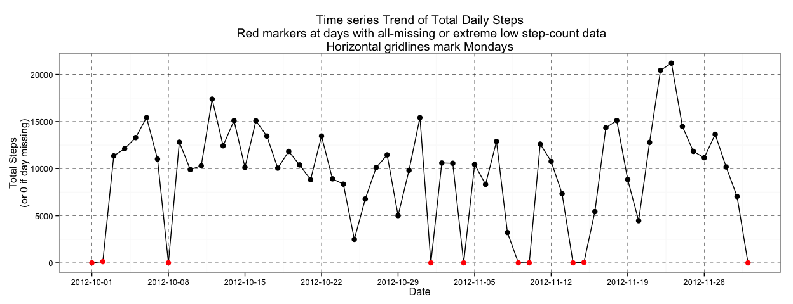
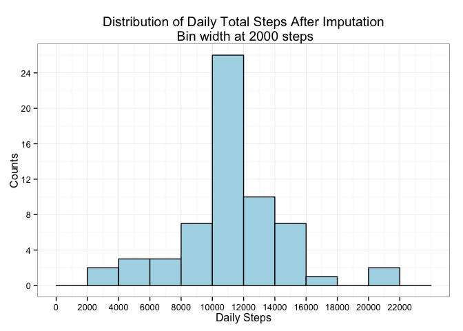

# Reproducible Research: Peer Assessment 1


```r
library(dplyr)
```

```
## 
## Attaching package: 'dplyr'
## 
## The following object is masked from 'package:stats':
## 
##     filter
## 
## The following objects are masked from 'package:base':
## 
##     intersect, setdiff, setequal, union
```

```r
library(ggplot2)
```

## Loading and preprocessing the data

### Load from zip and preprocess


```r
activity <- read.csv(unz("activity.zip", "activity.csv"), colClasses = list(date = "Date"))

# Convert the intervals column into a factor, 
# so that during plotting/processing we won't treat them as integer numbers.
# (ie. we make the distance between 1155 and 1200 equal to the distance between 1145 and 1150)
# Also make the interval labels a bit more human-readable.
activity$interval <- factor(sprintf("%04d", activity$interval))
```

### Get a feeling about the general structure


```r
str(activity)
```

```
## 'data.frame':	17568 obs. of  3 variables:
##  $ steps   : int  NA NA NA NA NA NA NA NA NA NA ...
##  $ date    : Date, format: "2012-10-01" "2012-10-01" ...
##  $ interval: Factor w/ 288 levels "0000","0005",..: 1 2 3 4 5 6 7 8 9 10 ...
```


```r
summary(activity)
```

```
##      steps             date               interval    
##  Min.   :  0.00   Min.   :2012-10-01   0000   :   61  
##  1st Qu.:  0.00   1st Qu.:2012-10-16   0005   :   61  
##  Median :  0.00   Median :2012-10-31   0010   :   61  
##  Mean   : 37.38   Mean   :2012-10-31   0015   :   61  
##  3rd Qu.: 12.00   3rd Qu.:2012-11-15   0020   :   61  
##  Max.   :806.00   Max.   :2012-11-30   0025   :   61  
##  NA's   :2304                          (Other):17202
```

## What is mean total number of steps taken per day?

### Overview of the full distribution


```r
activity.by.day <- summarize(group_by(activity, date), total_steps = sum(steps))

p <- ggplot(activity.by.day, aes(x = total_steps))
p <- p + geom_histogram(binwidth = 2000, color = "black", fill = "lightblue")
p <- p + scale_x_continuous(breaks = seq(0, 22000, 2000))
p <- p + scale_y_continuous(breaks = seq(0, 16, 4))
p <- p + ggtitle("Distribution of Daily Total Steps \n Bin width at 2000 steps")
p <- p + xlab("Daily Steps") + ylab("Counts")
p <- p + theme_bw()
p
```

 

Note: the missing values are automatically discarded from the plot.

### The central tendency of the distribution

#### Mean and median values


```r
mean(activity.by.day$total_steps, na.rm = TRUE)
```

```
## [1] 10766.19
```

```r
median(activity.by.day$total_steps, na.rm = TRUE)
```

```
## [1] 10765
```

The mean and the median are really close to each other, this is a sign of a well-centralized distribution.  

#### About interpreting the central tendency

The anonymous person generating this data is a yardstick for a healthy individual according to the Internet :)  
His/her 10000 average daily steps is at the level that's encouraged maybe not by medical professionals, but at least by pedometer vendors. Speaking from personal experience, it's not an easy goal to achieve consistently.  
Here are some articles on the subject:

* [fitbit blog](http://blog.fitbit.com/fitbit2014-challenge-week-1-take-2000-more-steps-every-day-this-week/) -- "The average Australian takes 9,695 steps per day, the average Japanese 7,168, and the average Swiss 9,650, while the average American takes only 5,117 steps per day."
* [The Truth about '10,000 Steps' a Day](http://www.livescience.com/43956-walking-10000-steps-healthy.html) -- "Studies conducted since then suggest that people who increased their walking to 10,000 steps daily experience health benefits."
* [The Walking Site](http://www.thewalkingsite.com/10000steps.html) -- "A sedentary person may only average 1,000 to 3,000 steps a day. For these people adding steps has many health benefits."
* [WebMD](http://blogs.webmd.com/womens-health/2014/10/10k-steps-a-day-a-realistic-goal.html) -- "Is there any evidence from studies to show that taking 10,000 steps a day really works for people? Do they lose weight? Are they healthier?"

#### About calculating the central tendency

Note that in these summary calculations we had to discard missing values explicitly.  
The alternative would have been to ignore the missings during the group_by summing, but then some days would have had zero total steps, but:

* in this case the distribution would have had a negative skew coming from this "automatic" imputation.
* And this would have been slightly incorrect because for each day we either have all intervals filled in or no intervals filled in (see more at the imputation strategy section below) so it doesn't make sense to assign zero to the missing days.

## What is the average daily activity pattern?

### Time series plot of average steps per interval


```r
activity.by.interval <- summarize(group_by(activity, interval), avg_steps = mean(steps, na.rm = TRUE))

p <- ggplot(activity.by.interval, aes(x = interval, y = avg_steps))
p <- p + geom_point() + geom_line(aes(group = 1))
p <- p + scale_x_discrete(breaks = c("0200", "0400", "0600", "0800", 1000, 1200, 1400, 1600, 1800, 2000, 2200))
p <- p + ggtitle("Average Daily Steps By Interval")
p <- p + xlab("Interval \n(format HHMM)") + ylab("Average Steps across All Days \n (NA's removed)")
p <- p + theme_bw()
p
```

 

The most active intervals:


```r
head(arrange(activity.by.interval, desc(avg_steps)))
```

```
## Source: local data frame [6 x 2]
## 
##   interval avg_steps
## 1     0835  206.1698
## 2     0840  195.9245
## 3     0850  183.3962
## 4     0845  179.5660
## 5     0830  177.3019
## 6     0820  171.1509
```

Interval `08:35` has the most step-activity on average across all days.

## Imputing missing values

### Missing values prevalence

In the summary above (in the section "Get a feeling about the general structure") we saw that only the `steps` column has missing values, the others are properly filled out.  
The proportion of missing vs. non-missing data is:


```r
table(is.na(activity$steps))
```

```
## 
## FALSE  TRUE 
## 15264  2304
```

```r
prop.table(table(is.na(activity$steps)))
```

```
## 
##     FALSE      TRUE 
## 0.8688525 0.1311475
```

~13% of step values are missing from the whole dataset.

### Imputation strategy

#### Missing values distribution


```r
# Helper dataset for missing-value analysis
activity.missings <- summarize(group_by(activity, date),
                               total_steps = sum(steps),
                               na_count = sum(is.na(steps)),
                               non_zero_count = sum(steps != 0))
```

The patterns for missing data is not random. For a given day in the original dataset, we either have data for all intervals, or we have none. This can be observed by the following list, which counts for each consecutive day the number of NA observations we have for it:


```r
arrange(activity.missings, date)$na_count
```

```
##  [1] 288   0   0   0   0   0   0 288   0   0   0   0   0   0   0   0   0
## [18]   0   0   0   0   0   0   0   0   0   0   0   0   0   0 288   0   0
## [35] 288   0   0   0   0 288 288   0   0   0 288   0   0   0   0   0   0
## [52]   0   0   0   0   0   0   0   0   0 288
```

There are 8 days in total which are fully missing.

Another source of bias could be that there are two days which have an unusally low total step count:


```r
head(arrange(activity.missings, total_steps))
```

```
## Source: local data frame [6 x 4]
## 
##         date total_steps na_count non_zero_count
## 1 2012-11-15          41        0              2
## 2 2012-10-02         126        0              2
## 3 2012-10-25        2492        0             44
## 4 2012-11-08        3219        0             52
## 5 2012-11-20        4472        0             47
## 6 2012-10-29        5018        0             62
```

These low step count days also have only two intervals that have non-zero measurements (`non_zero_count` column above).

Adding these to the all-missing days, we now have 10 potentially invalid days in the data.  
This is now 20% of the whole dataset.

To see the trend for where these days are in the time series, consider the following plot:


```r
# Add some helper columns and backfill NA's for plotting
activity.missings$na.or.low <- (activity.missings$na_count == 288 | activity.missings$non_zero_count <= 2)
activity.missings[is.na(activity.missings)] <- 0
activity.missings$is.monday <- weekdays(activity.missings$date) == "Monday"
```


```r
p <- ggplot(activity.missings, aes(date, total_steps)) 
p <- p + geom_line()
p <- p + geom_point(aes(color = na.or.low), size = 3)
p <- p + scale_color_manual(values = c("black", "red")) 
p <- p + scale_x_date(breaks = activity.missings$date[activity.missings$is.monday])
p <- p + theme_bw() + theme(panel.grid.major = element_line(linetype = "dashed", color = "black"))
p <- p + ggtitle("Time series Trend of Total Daily Steps\n Red markers at days with all-missing or extreme low step-count data\nHorizontal gridlines mark Mondays")
p <- p + guides(color = FALSE) + xlab("Date") + ylab("Total Steps\n(or 0 if day missing)")
p
```

 

* From this trend-plot we can see the missing/invalid days don't all fall on the same days of the week.
* But they tend to come in pairs and at least in some of the cases the missing days are hugged by relativlty lower stepcount days. This might mean that the subject didn't use the measurement device for an extended period of time.
* We could argue that the first two days (and maybe the last day) could be removed from the dataset altogether.

#### Imputation strategy decision

Considering everything in the previous section, the solution will replace all 10 days (marked with red) with the "average" day.
Note that:

* The average days is constructed from all the intervals on the "other" days. Remember from above, that all these days have all their intervals measured, so there will be no calculation problem arising from this.
* This might or might not be considered doing more than what the exercise prompts because it only mentioned strictly NA data (8 such days out of 10 filled). But we should consider extreme low days (2 out of 10) as "almost NA" too.
* We could try to come up with a more advanced interpolating scheme but that's beyond the point of this exercise.
* In the end it might actually be better to remove these days from the data instead of replacing it with the average day, if we submit to the argument that NA days don't let us learn anything about the subjects activity patterns on the rest of the days.

### Create filled dataset


```r
# These are the days we would ultimately want to
# a) discard when calculating the average day and
# b) replace all their intervals with the average day's intervals
invalid.days <- activity.missings$date[activity.missings$na.or.low]

average.day.intervals <- summarize(group_by(filter(activity, !date %in% invalid.days), interval),
                                   avg_steps = mean(steps))

# Add a new temporary column (avg_steps) to the activity dataframe.
# It augments each row in the original dataset with the interval-average for the row's interval.
activity.filled <- merge(activity, average.day.intervals)

# Use avg_steps to fill in missig values in steps column
activity.filled$steps <- ifelse(activity.filled$date %in% invalid.days,
                                activity.filled$avg_steps,
                                activity.filled$steps)

# Quick summary of what we got
summary(activity.filled)
```

```
##     interval         steps             date              avg_steps      
##  0000   :   61   Min.   :  0.00   Min.   :2012-10-01   Min.   :  0.000  
##  0005   :   61   1st Qu.:  0.00   1st Qu.:2012-10-16   1st Qu.:  2.583  
##  0010   :   61   Median :  0.00   Median :2012-10-31   Median : 35.451  
##  0015   :   61   Mean   : 38.84   Mean   :2012-10-31   Mean   : 38.837  
##  0020   :   61   3rd Qu.: 32.73   3rd Qu.:2012-11-15   3rd Qu.: 54.907  
##  0025   :   61   Max.   :806.00   Max.   :2012-11-30   Max.   :214.255  
##  (Other):17202
```

```r
# Remove temporary data
activity.filled$avg_steps <- NULL
rm(invalid.days)
rm(average.day.intervals)
```

### Compare filled dataset with original one

#### Distribution of the filled dataset


```r
activity.by.day.filled <- summarize(group_by(activity.filled, date), total_steps = sum(steps, na.rm = TRUE))

p <- ggplot(activity.by.day.filled, aes(x = total_steps))
p <- p + geom_histogram(binwidth = 2000, color = "black", fill = "lightblue")
p <- p + scale_x_continuous(breaks = seq(0, 22000, 2000))
p <- p + scale_y_continuous(breaks = seq(0, 24, 4))
p <- p + ggtitle("Distribution of Daily Total Steps After Imputation\n Bin width at 2000 steps")
p <- p + xlab("Daily Steps") + ylab("Counts")
p <- p + theme_bw()
p
```

 

#### Comparison statistics

The means and medians of dataset before and after imputation (labeled Original and Filled below):


```r
activity.by.day.both <- rbind(cbind(Dataset = "Original", activity.by.day),
                              cbind(Dataset = "Filled", activity.by.day.filled))
summarize(group_by(activity.by.day.both, Dataset), mean = mean(total_steps, na.rm = T), median = median(total_steps, na.rm = T))
```

```
## Source: local data frame [2 x 3]
## 
##    Dataset     mean   median
## 1 Original 10766.19 10765.00
## 2   Filled 11185.12 11185.12
```

The estimate of the central tendency changed a bit:

* First it increased slightly (the Filled means are higher) because the two low-activity days were removed.
* Also it became more centralized (the Filled mean and median are now the same) because the way we imputed was putting more values exactly into the mean.
* A more detailed picture could be gleaned from the 5-number summary of the two datasets and by superimosing the two distributions on top of each other:


```r
summary(activity.by.day$total_steps)
```

```
##    Min. 1st Qu.  Median    Mean 3rd Qu.    Max.    NA's 
##      41    8841   10760   10770   13290   21190       8
```

```r
summary(activity.by.day.filled$total_steps)
```

```
##    Min. 1st Qu.  Median    Mean 3rd Qu.    Max. 
##    2492   10060   11190   11190   12810   21190
```


```r
p <- ggplot(activity.by.day.both, aes(x = total_steps, linetype = Dataset))
p <- p + geom_density(size = 1.5, adjust = .9)
p <- p + scale_x_continuous(breaks = seq(0, 22000, 2000))
p <- p + ggtitle("Distribution of Daily Total Steps Before and After Imputation")
p <- p + xlab("Daily Steps") + ylab("Density")
p + theme_bw()
```

```
## Warning: Removed 8 rows containing non-finite values (stat_density).
```

 

## Are there differences in activity patterns between weekdays and weekends?

```
mfrm$weekday <- ifelse(weekdays(mfrm$date) %in% c("Saturday", "Sunday"), "Weekend", "Weekday")
sfrm.intervals <- summarize(group_by(mfrm, interval, weekday), avg_steps = mean(steps, na.rm = TRUE))
ggplot(sfrm.intervals, aes(x = interval, y = avg_steps)) + geom_point() + scale_x_discrete(breaks = c("0600", 1200, 1800)) + facet_grid(weekday ~ .) + geom_line(aes(group = 1))
```

```
ggplot(sfrm.intervals, aes(x = interval, y = avg_steps, color = weekday)) + geom_point() + scale_x_discrete(breaks = c("0600", 1200, 1800)) + geom_line(aes(group = weekday))
```
